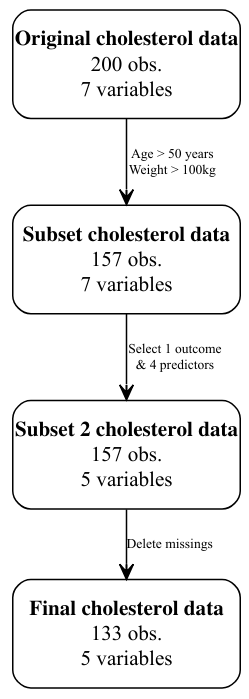

```{r setup, include=FALSE}
# Please do not touch this part
knitr::opts_chunk$set(echo = T, message = F, warning = F)

# Packages needed
library(ggplot2)
library(psych) # only for people who use Cronbach's alpha in their analysis
```


\vspace{2cm}

Dataset chosen (course on 01.03.2021): XX   


\vspace{13cm}

*REMINDER: please provide in a .zip file the .Rmd, .pdf, figure, and the data used. We should be able to run your .Rmd file if everything was done in .Rmd. NO MANUAL CHANGES!!!*

\newpage

\begin{centering}

{\Large TECHNICAL REPORT (08.03.2021)}

\end{centering}

\normalsize

# Background

## Prevalence of the problem

1-2 sentences

## Importance

1-2 sentences

## Why is it a problem?

1-2 sentences

## Key variables

1-2 sentences  
QUESTION: What .....?

\vspace{1cm}


# Objective

1 sentence


\vspace{1cm}


# Methods & results

## Sample selection

1) Give total size of data at the start and at the end (n observations and n variables) with a flowchart
2) Select a population of interest (one criteria is enough), which makes sense  
3) Select and explain variables for your analysis

```{r}
# Import data
ch <- read.table("data/chol.txt", sep = "", header = T)

# Discover your data for you only (meaning no code written for that part)

# Select population of interest

# Choose 5 variables: 1 outcome and 4 predictors (if you wish you can rename them)

# Show your subset (ONLY for subset NOT full data)

```

All the rest of your analysis will be done on your subset data!

## Missing

Checking for missing. If you do not have any, just mention it and show the code you used to check for it. If you have missing, remove them. 

```{r}
# Provide the code for checking the missing

# If you have any missing, please show how you delete them

```


## Flowchart

You can create the flowchart in the program you want (PowerPoint, Visio, Keynote, LibreOffice Draw, ...)
and import the image with the following code: 

{width=3cm}


## Overview of the variables

Basic way of doing table in R Markdown -> more advanced tables in Stats 3

```{r}
# Do everything needed on your 5 variables

######################
# Variable Age (age)
######################

# age kept as it is for linear regression and with same name

# New variable for age as categorical for logistic model
# Check distribution of age
summary(ch$age)
# Use the quartiles for the grouping 
ch$age_c <- "group 2 (> 28.5 & < 42)"
ch$age_c[ch$age <= 28.5] <- "group 1 (<= 28.5)"
ch$age_c[ch$age >= 42] <- "group 3 (>= 42)"
ch$age_c <- as.factor(ch$age_c) # factor variables for regressions


##########################
# Variable Smoking (smoke)
##########################


```

\newpage
\blandscape


Writing in a transparent way what was done on your 5 variables (short summary) into the table below

**Variable** | **Name in R** | **Type** | **What** | **Answer options** | **What was done** | **New name** | **New type** |
------|---------|-----|-------|---------------|-------------------|----------|----------|
Age | age | integer | predictor | 0 to 99 years | Linear model: nothing | age | integer |
| |  |  | |  |Logistic model: grouping into Group 1 (<= 28.5),  Group 2 (between 28.5 and 42), and Group 3 (>= 42) + change into factor | age_c | factor |
Smoking | smoke | character | predictor | 3 groups: nonsmo (non-smokers), sigare, and pipe | Linear + logistic model: group in two groups only: smoking (sigare + pipe) and non-smoking (nonsmo) | smoking | factor | 
Cholesterol  | chol | integer | outcome | values in mg/dl | Linear model: nothing | chol | integer | 
| | | |  |  | Logistic model: dichotomized into 0 (< 350) and 1 (>= 350) | chol_d | factor |


\elandscape

\newpage

## Descriptive analysis

### Summary statistics in table (course 15.03.2021)

```{r}
# Create a summary statistics table as seen in class

```

Provide 2-3 sentences about the key characteristics of your sample selected.

### Plot 1 (course 22.03.2021)

```{r}
# Bar chart with the option position=“fill” for your outcome and one predictor

```

Provide 1-2 sentences about what you see from your plot

### Plot 2 (course 22.03.2021)

```{r}
# boxplot by using the faceting option

```

Provide 1-2 sentences about what you see from your plot

## Inferential analysis

### Linear regression (course 26.04.2021)

Explain your approach in 1 sentence (backward, forward, or both)  -> only manual approach
Justify the choice of the format of your variables (1 sentence)

```{r}
# Provide your model with which you begin and its output

# Provide final model that is the "best"
```

Explain in 2-3 sentences how you end up to your final model  
What does your final model mean based on the coefficients? (1-2 sentences)


### Logistic regression (course 03.05.2021)

Explain your approach in 1 sentence (backward, forward, or both)  
Justify the choice of the format of your variables (1 sentence)

```{r}
# Provide your model with which you begin and its output

# Provide final model that is the "best"
```

Explain in 2-3 sentences how you end up to your final model  
What does your final model mean based on the coefficients? (1-2 sentences)

\vspace{1.5cm}


# Discussion

## Summary of the key results

2 sentences

## Which model is the best? Why?

2 sentences

## Interpret the results of the model/effect size

2 sentences

## Further steps?

1 sentence

\newpage

\begin{centering}

{\Large ABSTRACT (max 500 words)}

\end{centering}

\normalsize


# Background
Summary of your background in the technical report


# Objective
One sentence: what was the goal?

# Method
Provide key information on what was done: population, variables, descriptive and modeling approach.

# Results
Provide key results about the descriptive and modeling approach. What was found?

# Discussion
What did we learn? What should be next potential steps? Limitations?
